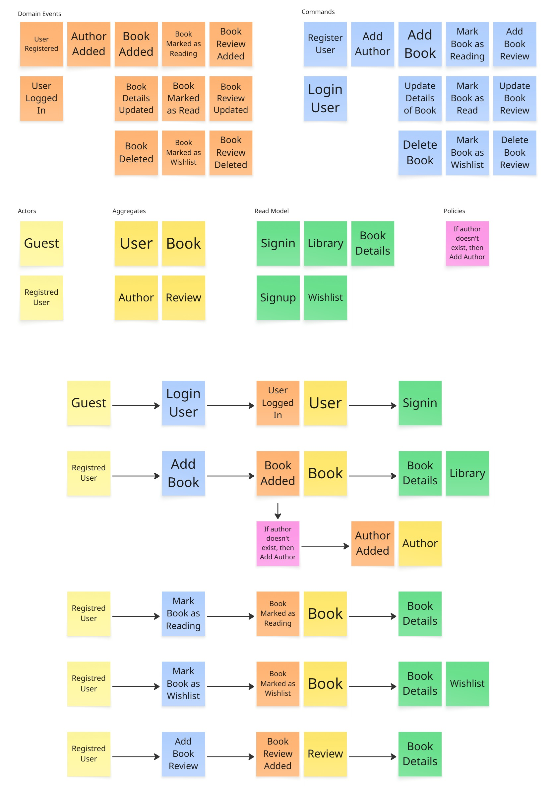
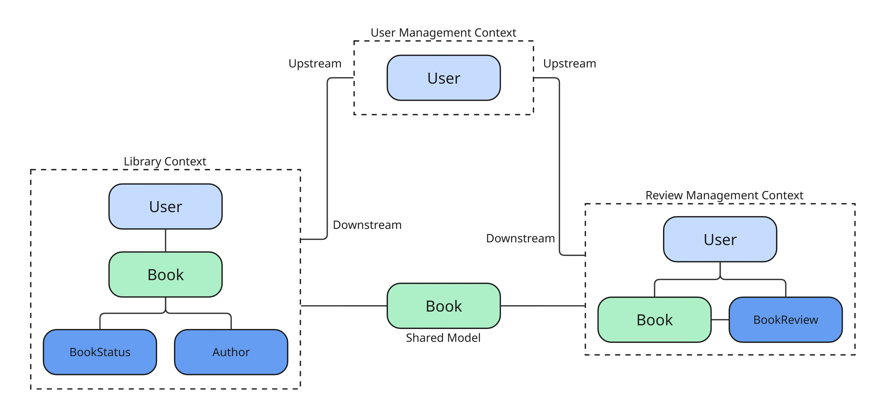

## Мета Роботи
Здобуття практичних навичок проектування, програмування та документування програмного забезпечення.

## Завдання Роботи
Розробити специфікацію та код системи.

## Результати роботи
### Ubiquitous Language

- **Application**: Cloud system for home library
- **User**: App user
- **Book**: Book in a library
  - Title
  - Description
  - Author
  - Published Date
  - BookStatus
  - Review
- **Author**: Author of the books in a library
  - Name
- **BookStatus**: Owned, Read, Reading, Wishlist
- **BookReview**: User's personal review of a book
  - Rating
  - Text

### Event Storming

### Context Map

