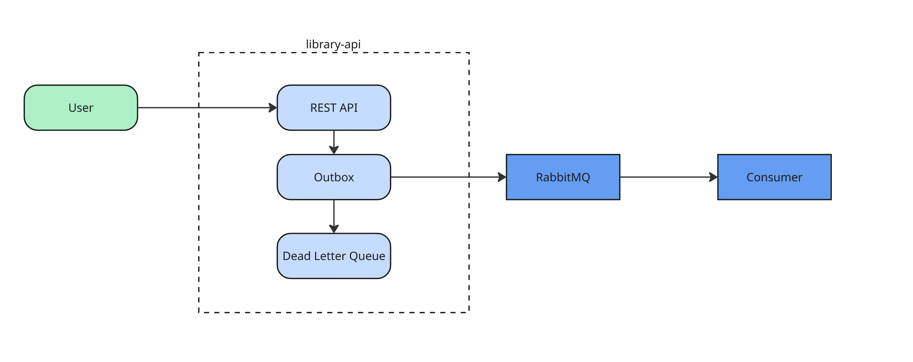

## Мета Роботи
Здобуття практичних навичок використання message broker-ів і розподіленого трасування.

## Завдання Роботи
Додати до програми з ЛР1 message broker і tracer, створити consumer сервіс для отримаття месседжів з брокера  

### Data Flow Diagram

### Code Presentation

RabbitMQ module with client for book_queue, outbox repository with in-memory storage and processor sending events to queue with intervals and retrying on failure.
Consumer service recieving messages from queue and logging them to console. 
Tracer creating traces and logging them to console.